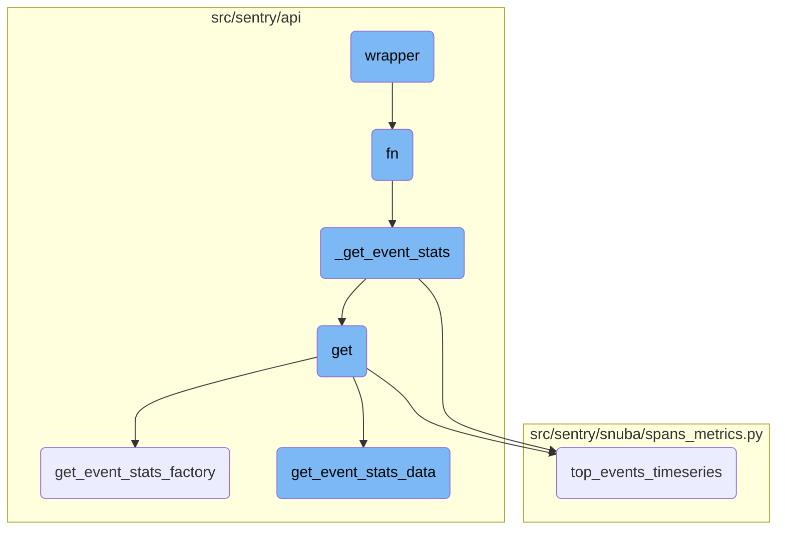
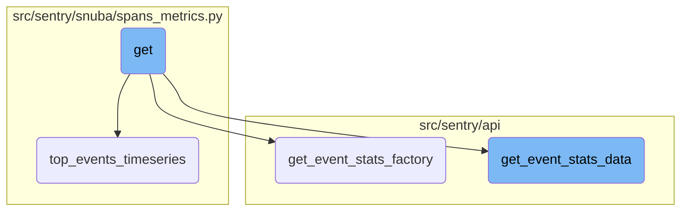

This document explains the purpose and functionality of the wrapper function. The wrapper function is designed to handle the execution of another function while tracking its success or failure. It uses a try-except block to execute the function and increments a metric based on whether an exception was raised. This helps in monitoring the success rate of the function.

The wrapper function runs another function and keeps track of whether it succeeds or fails. If the function runs without any errors, it records a success. If there is an error, it records a failure. This way, you can see how often the function works correctly.

Here is a high level diagram of the flow, showing only the most important functions:



# Flow drill down

First, we'll zoom into this section of the flow:

```mermaid
graph TD;
      subgraph src/sentry
e72ab6dbe0f378f7e7861f40695e651d45eb8e58e13f3d46881cea3ab3dff22c(wrapper):::mainFlowStyle --> 780bcbb7f1ba504427a19b761ba7a3bd49ed1d66d66daa8ef3d67ccaf80a796b(fn):::mainFlowStyle
end

subgraph src/sentry
780bcbb7f1ba504427a19b761ba7a3bd49ed1d66d66daa8ef3d67ccaf80a796b(fn):::mainFlowStyle --> ad78852d294414355cc4c1d586c85e1393b026807c627189ee95bfe783a81e9d(_get_event_stats):::mainFlowStyle
end

subgraph src/sentry
ad78852d294414355cc4c1d586c85e1393b026807c627189ee95bfe783a81e9d(_get_event_stats):::mainFlowStyle --> bc6d31d72bc18284a8d977c0ed48626395c14e576180df10f123120acbdabb9b(top_events_timeseries)
end

subgraph src/sentry
ad78852d294414355cc4c1d586c85e1393b026807c627189ee95bfe783a81e9d(_get_event_stats):::mainFlowStyle --> abc6480ff9e6702434a01780407f1b1b353e9678808b51b4270e726788e2f826(get):::mainFlowStyle
end

subgraph src/sentry
abc6480ff9e6702434a01780407f1b1b353e9678808b51b4270e726788e2f826(get):::mainFlowStyle --> st7qk(...)
end


      classDef mainFlowStyle color:#000000,fill:#7CB9F4
classDef rootsStyle color:#000000,fill:#00FFF4
classDef Style1 color:#000000,fill:#00FFAA
classDef Style2 color:#000000,fill:#FFFF00
classDef Style3 color:#000000,fill:#AA7CB9

%% Swimm:
%% graph TD;
%%       subgraph <SwmPath>[src/sentry/](src/sentry/)</SwmPath>
%% e72ab6dbe0f378f7e7861f40695e651d45eb8e58e13f3d46881cea3ab3dff22c(wrapper):::mainFlowStyle --> 780bcbb7f1ba504427a19b761ba7a3bd49ed1d66d66daa8ef3d67ccaf80a796b(fn):::mainFlowStyle
%% end
%% 
%% subgraph <SwmPath>[src/sentry/](src/sentry/)</SwmPath>
%% 780bcbb7f1ba504427a19b761ba7a3bd49ed1d66d66daa8ef3d67ccaf80a796b(fn):::mainFlowStyle --> ad78852d294414355cc4c1d586c85e1393b026807c627189ee95bfe783a81e9d(_get_event_stats):::mainFlowStyle
%% end
%% 
%% subgraph <SwmPath>[src/sentry/](src/sentry/)</SwmPath>
%% ad78852d294414355cc4c1d586c85e1393b026807c627189ee95bfe783a81e9d(_get_event_stats):::mainFlowStyle --> bc6d31d72bc18284a8d977c0ed48626395c14e576180df10f123120acbdabb9b(top_events_timeseries)
%% end
%% 
%% subgraph <SwmPath>[src/sentry/](src/sentry/)</SwmPath>
%% ad78852d294414355cc4c1d586c85e1393b026807c627189ee95bfe783a81e9d(_get_event_stats):::mainFlowStyle --> abc6480ff9e6702434a01780407f1b1b353e9678808b51b4270e726788e2f826(get):::mainFlowStyle
%% end
%% 
%% subgraph <SwmPath>[src/sentry/](src/sentry/)</SwmPath>
%% abc6480ff9e6702434a01780407f1b1b353e9678808b51b4270e726788e2f826(get):::mainFlowStyle --> st7qk(...)
%% end
%% 
%% 
%%       classDef mainFlowStyle color:#000000,fill:#7CB9F4
%% classDef rootsStyle color:#000000,fill:#00FFF4
%% classDef Style1 color:#000000,fill:#00FFAA
%% classDef Style2 color:#000000,fill:#FFFF00
%% classDef Style3 color:#000000,fill:#AA7CB9
```



<SwmSnippet path="/src/sentry_plugins/amazon_sqs/plugin.py" line="33">

---

## Wrapper Function

The <SwmToken path="src/sentry_plugins/amazon_sqs/plugin.py" pos="33:3:3" line-data="    def wrapper(*args, **kwargs):">`wrapper`</SwmToken> function is designed to handle the execution of another function <SwmToken path="src/sentry_plugins/amazon_sqs/plugin.py" pos="35:5:5" line-data="            success = fn(*args, **kwargs)">`fn`</SwmToken> while tracking its success or failure. It uses a try-except block to execute <SwmToken path="src/sentry_plugins/amazon_sqs/plugin.py" pos="35:5:5" line-data="            success = fn(*args, **kwargs)">`fn`</SwmToken> and increments a metric based on whether an exception was raised. This helps in monitoring the success rate of the <SwmToken path="src/sentry_plugins/amazon_sqs/plugin.py" pos="35:5:5" line-data="            success = fn(*args, **kwargs)">`fn`</SwmToken> function.

```python
    def wrapper(*args, **kwargs):
        try:
            success = fn(*args, **kwargs)
            metrics.incr(
                "data-forwarding.http_response", tags={"plugin": "amazon-sqs", "success": success}
            )
        except Exception:
            metrics.incr(
                "data-forwarding.http_response", tags={"plugin": "amazon-sqs", "success": False}
            )
            raise
        return success
```

---

</SwmSnippet>

<SwmSnippet path="/src/sentry/api/endpoints/organization_events_stats.py" line="340">

---

## FN Function

The <SwmToken path="src/sentry/api/endpoints/organization_events_stats.py" pos="340:3:3" line-data="            def fn(">`fn`</SwmToken> function is responsible for fetching event statistics. It first checks if metrics are enhanced and if a dashboard widget ID is present. Depending on these conditions, it either calls <SwmToken path="src/sentry/api/endpoints/organization_events_stats.py" pos="350:3:3" line-data="                    return _get_event_stats(">`_get_event_stats`</SwmToken> directly or performs additional logic to handle widget splits and error checks before calling <SwmToken path="src/sentry/api/endpoints/organization_events_stats.py" pos="350:3:3" line-data="                    return _get_event_stats(">`_get_event_stats`</SwmToken>.

```python
            def fn(
                query_columns: Sequence[str],
                query: str,
                snuba_params: SnubaParams,
                rollup: int,
                zerofill_results: bool,
                comparison_delta: datetime | None,
            ) -> SnubaTSResult | dict[str, SnubaTSResult]:

                if not (metrics_enhanced and dashboard_widget_id):
                    return _get_event_stats(
                        scoped_dataset,
                        query_columns,
                        query,
                        snuba_params,
                        rollup,
                        zerofill_results,
                        comparison_delta,
                    )

                try:
```

---

</SwmSnippet>

<SwmSnippet path="/src/sentry/api/endpoints/organization_events_stats.py" line="360">

---

### Handling Widget Splits

If the widget has a split and the override feature is not enabled, the function modifies the query and dataset accordingly before calling <SwmToken path="src/sentry/api/endpoints/organization_events_stats.py" pos="276:3:3" line-data="        def _get_event_stats(">`_get_event_stats`</SwmToken>. This ensures that the data is fetched based on the widget's configuration.

```python
                try:
                    widget = DashboardWidget.objects.get(id=dashboard_widget_id)
                    does_widget_have_split = widget.discover_widget_split is not None
                    has_override_feature = features.has(
                        "organizations:performance-discover-widget-split-override-save",
                        organization,
                        actor=request.user,
                    )

                    if does_widget_have_split and not has_override_feature:
                        # This is essentially cached behaviour and we skip the check
                        split_query = query
                        if widget.discover_widget_split == DashboardWidgetTypes.ERROR_EVENTS:
                            split_dataset = discover
                            split_query = f"({query}) AND !event.type:transaction"
                        elif widget.discover_widget_split == DashboardWidgetTypes.TRANSACTION_LIKE:
                            # We can't add event.type:transaction for now because of on-demand.
                            split_dataset = scoped_dataset
                        else:
                            # This is a fallback for the ambiguous case.
                            split_dataset = discover
```

---

</SwmSnippet>

<SwmSnippet path="/src/sentry/api/endpoints/organization_events_stats.py" line="392">

---

### Error and Transaction Checks

The function performs additional checks to see if the results contain errors or transactions. It modifies the queries and calls <SwmToken path="src/sentry/api/endpoints/organization_events_stats.py" pos="396:5:5" line-data="                        error_results = _get_event_stats(">`_get_event_stats`</SwmToken> multiple times to fetch the required data. The results are then used to make a decision on how to split the data for the widget.

```python
                    # Widget has not split the discover dataset yet, so we need to check if there are errors etc.
                    errors_only_query = f"({query}) AND !event.type:transaction"
                    error_results = None
                    try:
                        error_results = _get_event_stats(
                            discover,
                            query_columns,
                            errors_only_query,
                            snuba_params,
                            rollup,
                            zerofill_results,
                            comparison_delta,
                        )
                        has_errors = self.check_if_results_have_data(error_results)
                    except SnubaError:
                        has_errors = False

                    original_results = _get_event_stats(
                        scoped_dataset,
                        query_columns,
                        query,
```

---

</SwmSnippet>

<SwmSnippet path="/src/sentry/api/endpoints/organization_events_stats.py" line="276">

---

## <SwmToken path="src/sentry/api/endpoints/organization_events_stats.py" pos="276:3:3" line-data="        def _get_event_stats(">`_get_event_stats`</SwmToken> Function

The <SwmToken path="src/sentry/api/endpoints/organization_events_stats.py" pos="276:3:3" line-data="        def _get_event_stats(">`_get_event_stats`</SwmToken> function is responsible for querying the dataset to fetch event statistics. It either calls <SwmToken path="src/sentry/api/endpoints/organization_events_stats.py" pos="286:5:5" line-data="                return scoped_dataset.top_events_timeseries(">`top_events_timeseries`</SwmToken> if the <SwmToken path="src/sentry/api/endpoints/organization_events_stats.py" pos="285:3:3" line-data="            if top_events &gt; 0:">`top_events`</SwmToken> parameter is greater than zero or performs a timeseries query directly. This function is crucial for fetching the data required by the <SwmToken path="src/sentry_plugins/amazon_sqs/plugin.py" pos="35:5:5" line-data="            success = fn(*args, **kwargs)">`fn`</SwmToken> function.

```python
        def _get_event_stats(
            scoped_dataset: Any,
            query_columns: Sequence[str],
            query: str,
            snuba_params: SnubaParams,
            rollup: int,
            zerofill_results: bool,
            comparison_delta: datetime | None,
        ) -> SnubaTSResult | dict[str, SnubaTSResult]:
            if top_events > 0:
                return scoped_dataset.top_events_timeseries(
                    timeseries_columns=query_columns,
                    selected_columns=self.get_field_list(organization, request),
                    equations=self.get_equation_list(organization, request),
                    user_query=query,
                    snuba_params=snuba_params,
                    orderby=self.get_orderby(request),
                    rollup=rollup,
                    limit=top_events,
                    organization=organization,
                    referrer=referrer + ".find-topn",
```

---

</SwmSnippet>

<SwmSnippet path="/src/sentry/snuba/spans_metrics.py" line="144">

---

## <SwmToken path="src/sentry/snuba/spans_metrics.py" pos="144:2:2" line-data="def top_events_timeseries(">`top_events_timeseries`</SwmToken> Function

The <SwmToken path="src/sentry/snuba/spans_metrics.py" pos="144:2:2" line-data="def top_events_timeseries(">`top_events_timeseries`</SwmToken> function is a <SwmToken path="src/sentry/snuba/spans_metrics.py" pos="97:1:3" line-data="    High-level API for doing arbitrary user timeseries queries against events.">`High-level`</SwmToken> API for performing timeseries queries for a limited number of top events. It constructs and executes the query, processes the results, and returns a dictionary of <SwmToken path="src/sentry/api/endpoints/organization_events_stats.py" pos="284:5:5" line-data="        ) -&gt; SnubaTSResult | dict[str, SnubaTSResult]:">`SnubaTSResult`</SwmToken> objects. This function is used by <SwmToken path="src/sentry/api/endpoints/organization_events_stats.py" pos="276:3:3" line-data="        def _get_event_stats(">`_get_event_stats`</SwmToken> to fetch the top events data.

```python
def top_events_timeseries(
    timeseries_columns,
    selected_columns,
    user_query,
    snuba_params,
    orderby,
    rollup,
    limit,
    organization,
    equations=None,
    referrer=None,
    top_events=None,
    allow_empty=True,
    zerofill_results=True,
    include_other=False,
    functions_acl=None,
    on_demand_metrics_enabled=False,
    on_demand_metrics_type: MetricSpecType | None = None,
    query_source: QuerySource | None = None,
):
    """
```

---

</SwmSnippet>

Now, lets zoom into this section of the flow:



<SwmSnippet path="/src/sentry/api/endpoints/organization_events_stats.py" line="183">

---

## Handling Event Statistics

The <SwmToken path="src/sentry/api/endpoints/organization_events_stats.py" pos="183:3:3" line-data="    def get(self, request: Request, organization: Organization) -&gt; Response:">`get`</SwmToken> function is responsible for handling the request to fetch event statistics for an organization. It processes the request parameters and delegates the task to other helper functions to gather the required data.

```python
    def get(self, request: Request, organization: Organization) -> Response:
        query_source = self.get_request_source(request)
        with sentry_sdk.start_span(op="discover.endpoint", description="filter_params") as span:
            span.set_data("organization", organization)

            top_events = 0

            if "topEvents" in request.GET:
                try:
                    top_events = int(request.GET.get("topEvents", 0))
                except ValueError:
                    return Response({"detail": "topEvents must be an integer"}, status=400)
                if top_events > MAX_TOP_EVENTS:
                    return Response(
                        {"detail": f"Can only get up to {MAX_TOP_EVENTS} top events"},
                        status=400,
                    )
                elif top_events <= 0:
                    return Response({"detail": "If topEvents needs to be at least 1"}, status=400)

            comparison_delta = None
```

---

</SwmSnippet>

<SwmSnippet path="/src/sentry/api/endpoints/organization_events_stats.py" line="331">

---

### Event Statistics Factory

The <SwmToken path="src/sentry/api/endpoints/organization_events_stats.py" pos="331:3:3" line-data="        def get_event_stats_factory(scoped_dataset):">`get_event_stats_factory`</SwmToken> function creates a closure over the dataset to make additional requests to the errors dataset if needed. It handles the logic for splitting the dataset based on the type of widget and ensures that the correct data is fetched and returned.

```python
        def get_event_stats_factory(scoped_dataset):
            """
            This factory closes over dataset in order to make an additional request to the errors dataset
            in the case that this request is from a dashboard widget and we're trying to split their discover dataset.

            This should be removed once the discover dataset is completely split in dashboards.
            """
            dashboard_widget_id = request.GET.get("dashboardWidgetId", None)

            def fn(
                query_columns: Sequence[str],
                query: str,
                snuba_params: SnubaParams,
                rollup: int,
                zerofill_results: bool,
                comparison_delta: datetime | None,
            ) -> SnubaTSResult | dict[str, SnubaTSResult]:

                if not (metrics_enhanced and dashboard_widget_id):
                    return _get_event_stats(
                        scoped_dataset,
```

---

</SwmSnippet>

<SwmSnippet path="/src/sentry/api/bases/organization_events.py" line="388">

---

### Fetching Event Statistics Data

The <SwmToken path="src/sentry/api/bases/organization_events.py" pos="388:3:3" line-data="    def get_event_stats_data(">`get_event_stats_data`</SwmToken> function is responsible for fetching the event statistics data based on the provided parameters. It handles the query creation, execution, and serialization of the results. This function ensures that the data is correctly formatted and returned to the client.

```python
    def get_event_stats_data(
        self,
        request: Request,
        organization: Organization,
        get_event_stats: Callable[
            [Sequence[str], str, SnubaParams, int, bool, timedelta | None], SnubaTSResult
        ],
        top_events: int = 0,
        query_column: str = "count()",
        snuba_params: SnubaParams | None = None,
        query: str | None = None,
        allow_partial_buckets: bool = False,
        zerofill_results: bool = True,
        comparison_delta: timedelta | None = None,
        additional_query_column: str | None = None,
        dataset: Any | None = None,
    ) -> dict[str, Any]:
        with handle_query_errors():
            with sentry_sdk.start_span(
                op="discover.endpoint", description="base.stats_query_creation"
            ):
```

---

</SwmSnippet>

&nbsp;

*This is an auto-generated document by Swimm AI 🌊 and has not yet been verified by a human*

<SwmMeta version="3.0.0" repo-id="Z2l0aHViJTNBJTNBc2VudHJ5LWRlbW8tMSUzQSUzQVN3aW1tLURlbW8=" repo-name="sentry-demo-1" doc-type="flows"><sup>Powered by [Swimm](/)</sup></SwmMeta>
